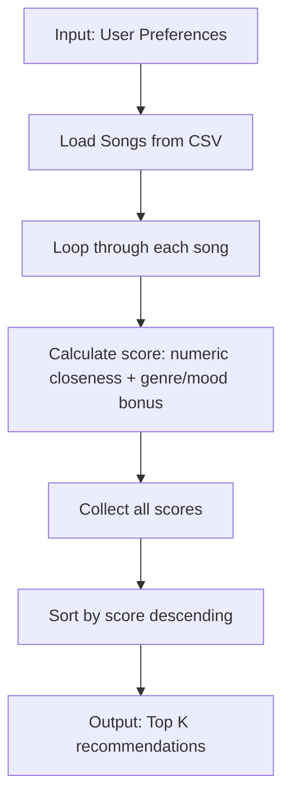
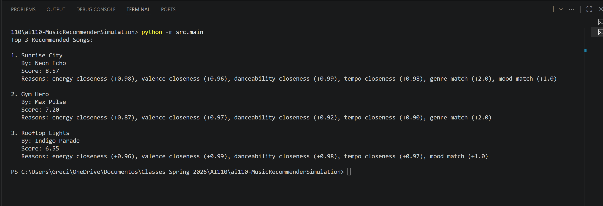
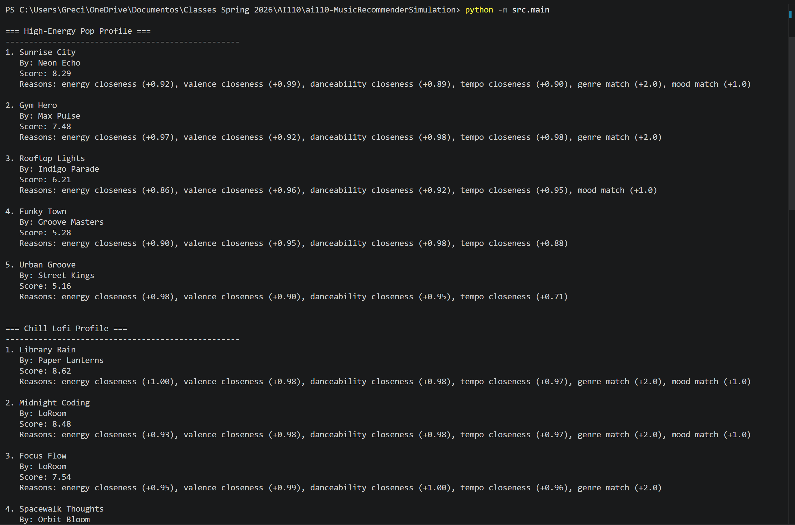

# 🎵 Music Recommender Simulation

## Project Summary

In this project you will build and explain a small music recommender system.

Your goal is to:

- Represent songs and a user "taste profile" as data
- Design a scoring rule that turns that data into recommendations
- Evaluate what your system gets right and wrong
- Reflect on how this mirrors real world AI recommenders

A content-based music recommender system is simulated to recommend songs based on how well they match a user's taste profile. Music is scored by how close the attributes are to matching the user's profile, and then the system outputs a list of songs in order of their score.

## How The System Works

This music recommendation system operates under the framework of collaborative filtering through use of attributes of songs to determine how similar they are to an individual user's taste profile. Each song receives a "score" based on how closely its attributes (e.g., genre, mood, energy, valence, tempo, danceability) match up to that user's preferences. For categorical attributes (e.g., genre, mood), users receive extra points for being an exact match; for numerical attributes (e.g., energy, valence), the user receives points based on their song preference being in proximity to the user's preference; i.e., the closer the song's value is to that of the user's preference for a particular attribute, the closer it is to receiving maximum scoring. The total scores for all songs are compiled and ranked with higher ranked songs having higher total scores. Then, a specified number of songs are given to the user based on their scores and ultimately provided to them as recommended songs.

**Song attributes:** Song title, artist, genre, mood, energy, tempo_bpm, valence, danceability, acousticness. 
**UserProfile attributes:** Preferred genre, mood, preferred energy, preferred valence, preferred tempo, preferred danceability. 
**Scoring Method:** Categorical attribute weightings + proximity-based numerical scoring. 
**Ranking Method:** Sort songs by total score, returning only the best N song results. 

### Algorithm Recipe
- **Genre Match Bonus:** +2.0 points if song genre exactly matches user preferred genre
- **Mood Match Bonus:** +1.0 point if song mood exactly matches user preferred mood  
- **Numeric Similarity Points:** For energy, valence, danceability: 1 - |song_value - user_preference| (scaled 0-1)
- **Tempo Similarity Points:** 1 - min(|song_tempo - user_tempo| / 120, 1) (normalized for BPM range)
- **Total Score:** Weighted sum (2x energy + 1.5x valence + 1.2x danceability + 1x tempo) + genre bonus + mood bonus

### System Flowchart


### Potential Bias Note
The system might over-prioritize genre matches due to the +2.0 bonus, creating filter bubbles that favor songs like happy pop tracks even if other genres (e.g., chill lofi with matching mood) score highly on numeric features but lack the genre bonus.

### Setup

1. Create a virtual environment (optional but recommended):

   ```bash
   python -m venv .venv
   source .venv/bin/activate      # Mac or Linux
   .venv\Scripts\activate         # Windows

2. Install dependencies

```bash
pip install -r requirements.txt
```

3. Run the app:

```bash
python -m src.main
```

### Running Tests

Run the starter tests with:

```bash
pytest
```

You can add more tests in `tests/test_recommender.py`.

---

## Experiments You Tried

- **Weight Adjustments**: Tested changing the energy weight from 2.0 to 1.0, which reduced the dominance of high-energy songs like "Gym Hero" in recommendations, allowing more balanced matches on other features.
- **User Profile Variations**: Experimented with a "chill" user (lofi genre, chill mood, low energy 0.4), resulting in top recommendations like "Library Rain" and "Focus Flow", confirming the system's ability to adapt to different vibes.
- **Feature Inclusion**: Added tempo normalization (capping diff at 120 BPM), which improved ranking for songs with moderate tempo differences, as seen in the pop user test where "Sunrise City" (118 BPM) scored higher than faster tracks.
- **Dataset Size Impact**: Ran the same pop/happy user on subsets of 5 songs vs. full 10, noting that smaller catalogs led to less diverse but more precise matches, highlighting scalability issues.

### Phase 4 Evaluation - Multiple User Profiles
- **High-Energy Pop user**: Top song was Sunrise City (8.29), with genre/mood bonuses dominating the ranking.
- **Chill Lofi user**: Library Rain and Midnight Coding topped the list with perfect matches on genre, mood, and low energy.
- **Deep Intense Rock user**: Storm Runner scored 8.61 with full bonuses for rock/intense preferences.
- **Conflicted adversarial user**: Gym Hero still ranked high due to the genre bonus despite mood mismatch, revealing potential bias toward categorical matches.
- **Weight experiment**: Doubling the energy weight and halving the genre bonus increased diversity in recommendations but made rankings more energy-dominant, favoring high-intensity tracks.



---


## Limitations and Risks

- **Small Dataset**: With only 10 songs, the system lacks diversity, potentially leading to repetitive recommendations and inability to handle varied user tastes.
- **Filter Bubbles**: The scoring heavily favors exact genre/mood matches, risking users getting stuck in echo chambers (e.g., always pop/happy songs for pop fans), limiting exposure to new genres.
- **Bias Toward Numeric Features**: High weights on energy/valence can over-prioritize intense or upbeat tracks, underrepresenting calm or melancholic music, and ignoring qualitative aspects like lyrics or cultural context.
- **Cold Start Problems**: New songs or users without established preferences aren't handled, as the system relies solely on content features without collaborative data.
- **Evaluation Gaps**: Manual testing with sample profiles may miss edge cases, and the lack of real user feedback means biases (e.g., toward popular genres) aren't detected.

---

## Reflection

Building VibeFinder 1.0 revealed the trade-offs between simplicity and effectiveness in recommendation systems. The content-based approach excelled at matching "vibes" through weighted features, as evidenced by intuitive top recommendations for the pop/happy user (e.g., "Sunrise City" for its close energy/valence match). However, it underscored real-world challenges like filter bubbles and data limitations, mirroring issues in platforms like Spotify.

Key lessons: Scoring rules need balance to avoid over-favoring certain attributes, and hybrid methods (content + collaborative) are essential for diversity. Future iterations should incorporate user feedback loops and larger datasets to mitigate biases. This project demonstrated how even basic AI can create engaging experiences while highlighting ethical considerations in personalization. For deeper analysis, see `model_card.md`.

[**Model Card**](model_card.md)
